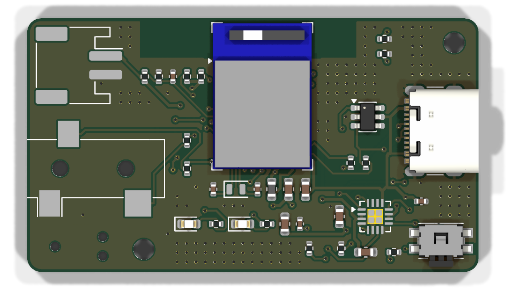

# ble-key nRF52840 board — schematic

The custom board from [PCB-PLAN.md](../PCB-PLAN.md): a Raytac MDBT50Q-1MV2 (nRF52840), a BQ24074
charger with power path, USB-C, a 3.5 mm paddle jack and a JST-PH socket for the LiPo.

| File | What |
|---|---|
| `ble-key.kicad_pro`, `ble-key.kicad_sch` | KiCad 10 project and schematic — open the project in KiCad |
| `ble-key-schematic.pdf` | the schematic as a PDF |
| `ble-key-bom.csv` | parts list with MPNs where chosen |
| `gen_schematic.py` | generates the schematic; the parts, values and nets live here |
| `ble-key.kicad_pcb` | the board: 48 × 27 mm, 2 layers, routed |
| `gen_board.py` | places the footprints, draws outline, holes, pours and the antenna keep-out |
| `route.py` | autoroutes the board with Freerouting, stitches the ground pours and refills them |
| `board-top.png`, `board-bottom.png` | renders of the routed board |
| `export_jlc.py`, `jlcpcb/` | JLCPCB production files: Gerbers + drill (zip), BOM and placement (CPL) |

**Status:** schematic and a first routed layout. ERC: 0 errors. DRC: 0 errors and 0 unconnected
pads; the remaining warnings are the paddle jack's outline crossing the board edge (its opening
overhangs the edge on purpose) and, until KiCad has been opened once, "library not in the
configuration" notices.



## Design

| Block | Choice |
|---|---|
| USB-C | GCT USB4105, 5.1 kΩ on CC1/CC2 (5 V sink), USBLC6-2SC6 ESD, 27 Ω series resistors to the module (Raytac reference) |
| Charger | BQ24074: 175 mA charge (R_ISET 5.1 kΩ, 0.5 C for 350 mAh), 500 mA input limit (R_ILIM 3.09 kΩ, EN2 = 1, EN1 = 0), TS on 10 kΩ (no thermistor), ITERM and TMR open for the datasheet defaults (10 % termination, 5 h safety timer) |
| Power | BQ24074 OUT (VSYS: 4.4 V on USB, battery voltage otherwise) feeds the module's VDDH. VDD is the module's own 3.3 V output, through its REG0 DC/DC converter with L1 (Raytac spec §8.1) |
| Module | MDBT50Q-1MV2, 32.768 kHz crystal on P0.00/P0.01 (the module has none) |
| Battery level | 1 MΩ + 1 MΩ divider with 100 nF into P0.29 / AIN5, about 2 µA drain |
| Charger status | ~PGOOD (USB present) on P0.30, ~CHG (charging) on P0.31, 100 kΩ pull-ups to VDD |
| Paddle | tip → 470 Ω → P0.04 (dit), ring → 470 Ω → P0.06 (dah), sleeve → GND; internal pull-ups |
| LEDs, reset | red P1.15, blue P1.10 — the Feather nRF52840 pins, so its bootloader drives them; reset button on P0.18 |
| Programming | Tag-Connect TC2030 pads for SWD (no part fitted) |

## Layout

- **48 × 27 mm, 2 layers, 1.6 mm, ENIG** (AISLER 2-layer ENIG rules: 0.125 mm track and space).
  Ground pour on both sides.
- **Module** at the top edge, antenna outward, with a copper-free strip along the top edge
  (12–35 mm, 4.2 mm deep) on both layers, wider than Raytac's minimum.
- **USB-C** on the right edge, **paddle jack** on the left edge, **battery JST** at the top-left
  with its plug pointing inward (the cell sits above the board in the case lid), **status LEDs** in
  the top-right corner, **reset button** on the bottom edge (side push).
- **SWD pads** (Tag-Connect TC2030-NL) on the back, bottom-left. Two M2 mounting holes.
- Net classes: signals 0.2 mm, power 0.3 mm, the reset line 0.15 mm so it can escape from the
  module's inner pad row.

**Ground:** routed like every other net first, so each pad has a real connection. Then about 145
stitching vias (0.6 mm, on a 1 mm grid wherever both pours have room) tie the front and back pours
together, a few 0.45 mm vias join pour patches that traces cut off, and the charger's exposed pad
has four thermal vias. KiCad's connectivity check finds no unconnected copper.

**Still worth a human look before ordering:** the USB pair is routed as two single tracks (fine
for 12 Mbit/s full speed), and the enclosure in `../enclosure/` is drawn around this board.
Raytac offers a free layout review.

## Open points

- **UICR.REGOUT0 = 3.3 V** must be written when the bootloader is flashed over SWD. In VDDH mode
  the nRF52840 starts with VDD at 1.8 V.
- **BQ24074 footprint:** KiCad's default has a 1.6 mm exposed pad, TI's drawing for the related
  RGT0016C package shows 1.68 mm. Check TI's RGT0016B drawing for the BQ24074 and pick the matching
  footprint.
- **Reset switch:** the footprint is Panasonic EVQ-PUC (side push). The EVP-AKE31A from the plan
  has no footprint in KiCad's library and would need a custom one.
- **MPNs still to choose** for the passives, L1 (10 µH 0603, ≥ 80 mA) and Y1 (32.768 kHz,
  2.0 × 1.2 mm, load capacitance matching the 12 pF capacitors), so AISLER can match them.
- **Layout rules from Raytac:** module at the board edge with the antenna end outward, a 3.8 mm
  copper-free strip across the antenna end on every layer, plenty of GND vias at the module corners.
  Raytac reviews layouts for free (service@raytac.com).

## JLCPCB

`python3 export_jlc.py` writes `jlcpcb/ble-key-gerbers.zip`, `jlcpcb/ble-key-bom.csv` and
`jlcpcb/ble-key-cpl.csv` for JLCPCB's PCB + SMT assembly order. The parts come from the schematic's
`LCSC` fields (the table at the top of `gen_schematic.py`). Choose 2 layers, 1.6 mm, ENIG, and
assembly on the top side only.

As of 1 October 2026:

- **Out of stock:** the MDBT50Q-1MV2 module (C5118826, 0 at JLCPCB and LCSC) and the EVQ-PUC02K
  reset switch (C79174, 1 left). Pre-order them into the JLCPCB parts library, or send them in.
- **Extended parts** (each adds JLCPCB's setup fee): the module, charger, ESD chip, USB-C, jack,
  JST, switch, inductor, crystal, blue LED, 3.09 kΩ and 27 Ω. The rest are Basic parts.
- **Different makers than the AISLER build** for the generic parts (red/blue LED, 12 pF), same
  values and packages.
- **Rotations:** after uploading, check JLCPCB's placement preview; parts their library orients
  differently get a correction in `ROTATION_FIX` in `export_jlc.py`.

## Regenerating

Schematic, then board, then routing:

```bash
.venv/bin/python gen_schematic.py
/Applications/KiCad/KiCad.app/Contents/MacOS/kicad-cli sch export netlist -o ble-key.net ble-key.kicad_sch
/Applications/KiCad/KiCad.app/Contents/Frameworks/Python.framework/Versions/Current/bin/python3 gen_board.py
/Applications/KiCad/KiCad.app/Contents/Frameworks/Python.framework/Versions/Current/bin/python3 route.py 100
/Applications/KiCad/KiCad.app/Contents/MacOS/kicad-cli pcb drc ble-key.kicad_pcb
```

`route.py` runs Freerouting 2.4.1 in its Docker image (`ghcr.io/freerouting/freerouting:2.4.1`,
no network access). Each run may route slightly differently.

### Schematic symbols

The generator copies symbols from KiCad's standard libraries into `.kilib/` (not committed):

```bash
uv venv --python 3.12 .venv && uv pip install --python .venv/bin/python -r requirements.txt
mkdir -p .kilib && docker run --rm --platform linux/amd64 -v "$PWD/.kilib":/out kicad/kicad:10.0 bash -c 'cd /usr/share/kicad/symbols && cp RF_Module.kicad_sym Battery_Management.kicad_sym Connector.kicad_sym Connector_Audio.kicad_sym Power_Protection.kicad_sym Device.kicad_sym Switch.kicad_sym power.kicad_sym /out/'
.venv/bin/python gen_schematic.py
```

With KiCad installed, the libraries can be copied from `/Applications/KiCad/KiCad.app/Contents/SharedSupport/symbols/`
instead, and `kicad-cli sch erc ble-key.kicad_sch` checks the result.
