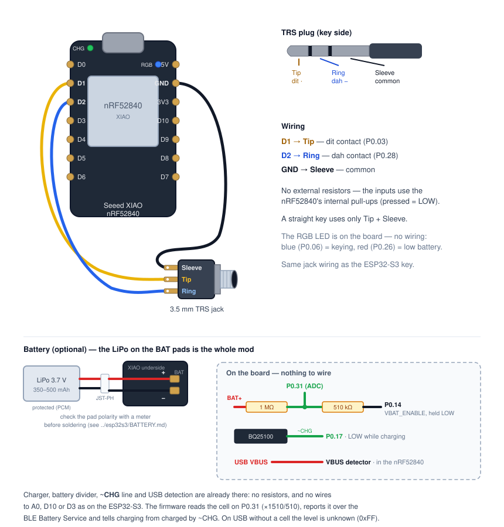

# ble-key on the XIAO nRF52840

Firmware for the [Seeed Studio XIAO nRF52840](https://wiki.seeedstudio.com/XIAO_BLE/). The BLE
contract, the build tools and the case are shared with the ESP32-S3 key and described in the
[main README](../README.md). The board-independent firmware lives in
[`../lib/BleKeyCore`](../lib/BleKeyCore/src/BleKeyCore.h); this sketch adds the Bluefruit BLE
stack, the pins, the battery readings and System OFF.

## Pins and wiring

| Signal      | XIAO pin | nRF pin | Notes                                       |
|-------------|----------|---------|---------------------------------------------|
| Dit         | `D1`     | P0.03   | Tip, `INPUT_PULLUP`, pressed = LOW          |
| Dah         | `D2`     | P0.28   | Ring, `INPUT_PULLUP`, pressed = LOW         |
| Keying LED  | blue LED | P0.06   | active-low                                  |
| Low battery | red LED  | P0.26   | active-low, double blink at boot below 3.5 V |
| Battery     | on board | P0.31   | 1 MΩ / 510 kΩ divider, enabled by P0.14 LOW |
| Charging    | on board | P0.17   | BQ25100 `~CHG`, LOW while charging          |
| USB power   | on chip  | —       | the nRF52840's VBUS detector                |

The paddle jack is wired exactly as on the ESP32-S3 (`D1` tip, `D2` ring, `GND` sleeve). For
the battery only the cell is soldered on — none of the resistors or wires of the ESP32-S3's
battery strips are needed here:



## Battery

Solder a single-cell LiPo with protection circuit to the `BAT` pads on the underside — that is
the whole mod. The XIAO nRF52840 has the charger, the voltage divider and the charge-status
line on board, and the chip sees USB power itself. Cell choice, polarity and soldering are the
same as for the ESP32-S3 key: see [`../esp32s3/BATTERY.md`](../esp32s3/BATTERY.md) up to and
excluding "The voltage divider".

- **Battery Service:** always present. Off USB the key can only be running from a cell; on USB
  without one it reports the level as `0xFF` (unknown), like the ESP32-S3 key.
- **Power state:** off USB a plausible reading means *on cell*. On USB, `~CHG` held low for two
  3 s windows means *charging*; released after that, *charged*. Released from the start (a full
  cell or no cell) stays *unknown*. *No cell* is never reported — what the BQ25100 does on
  `~CHG` without a cell is not verified yet.
- **Charge current:** the core's default, 50 mA. Seeed's wiki describes how P0.13 switches it to
  100 mA; the firmware leaves it alone.
- **VBAT_ENABLE (P0.14)** is driven LOW for good: with it HIGH, as the core leaves it, a full
  cell lifts P0.31 above the chip's supply through the divider. LOW costs about 3 µA.

## Idle sleep

Off USB the key enters **System OFF** after ten idle minutes, with both paddle lines armed
(pull-up, sense LOW). The next dit or dah wakes it; that press is consumed by the boot, as on
the ESP32-S3. Plugging in USB wakes a sleeping key too. The GPIO latch tells the firmware which
paddle woke it (`[paddle] woke on key press (dah)`).

## Build & flash

```sh
./flash.sh nrf52840           # from the repository root
```

FQBN `Seeeduino:nrf52:xiaonRF52840` — Seeed's **non-mbed** core, which brings Adafruit's
Bluefruit library. `flash.sh` uploads over the USB serial bootloader. Two quirks of that core
it works around: it calls `python` (macOS only has `python3`), and its `adafruit-nrfutil` stops
under an ASCII locale.

If the board does not show up as a serial port (crashed firmware), double-tap the reset button:
the bootloader comes up with its own port and a USB drive, and `flash.sh` works
again.

### Bench build

Shorter idle sleep, from the repository root:

```sh
arduino-cli compile --fqbn Seeeduino:nrf52:xiaonRF52840 --library lib/BleKeyCore \
  --build-property "compiler.cpp.extra_flags=-DIDLE_SLEEP_MS=20000" nrf52840
```

System OFF has no timer, so there is no `SLEEP_TEST_TIMER_S` here; wake the key with the paddle.
The serial monitor misses the boot log after a wake; the firmware repeats the essentials 3 s
after boot (`[paddle] ready — woke on dit, advertising`).

## Measured

- **No cell, on USB (6 October 2026):** the battery pin reads 3748 mV — the charger's output,
  not a cell. The key correctly publishes the level as `0xFF` and the power state as unknown.
  This is why a reading on USB is never trusted without `~CHG` having shown a charge.

## Not yet measured

- Sleep current in System OFF and current while connected.
- Battery readings against a meter (divider tolerance, ADC offset).
- `~CHG` at the end of a charge (with no cell it did not report charging).
- Which of the case's light holes the RGB LED lines up with.
